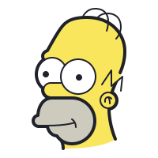

 
<h3 align="center">Simpsons Quote Generator</h3>

Source code for Simpsons-Quote-Generator. Powered by Javascript, HTML and CSS.

<h2></h2>

 

 

## Description
Simpsons-Quote-Generator uses the API simspsonsquoteapi to generate a random quote, character and image.

## Acknowledgements
https://thesimpsonsquoteapi.glitch.me/
## Demo

## Contributions
Contributions are always welcome!  
Just make a [pull request](../../pulls).

## Licence
MIT license
